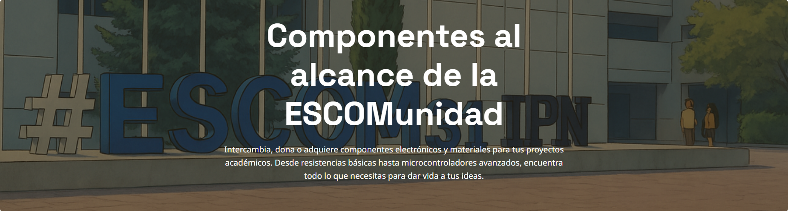
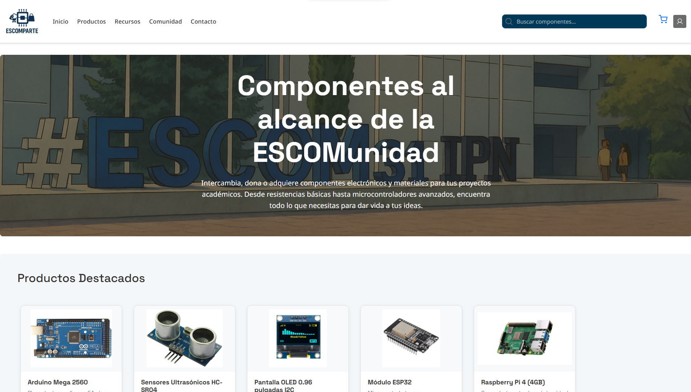
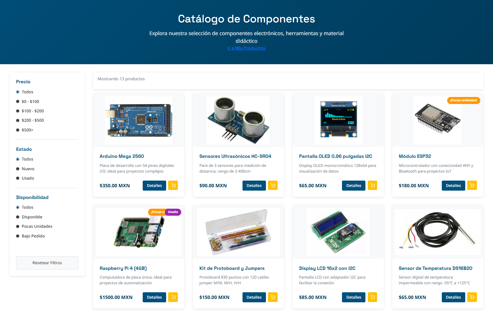
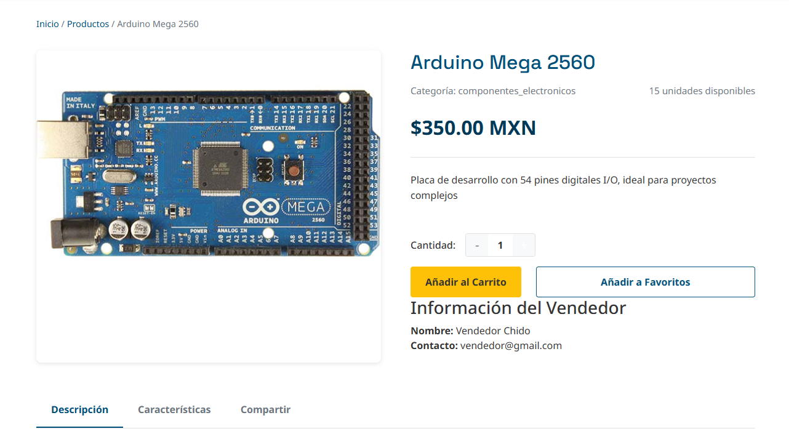
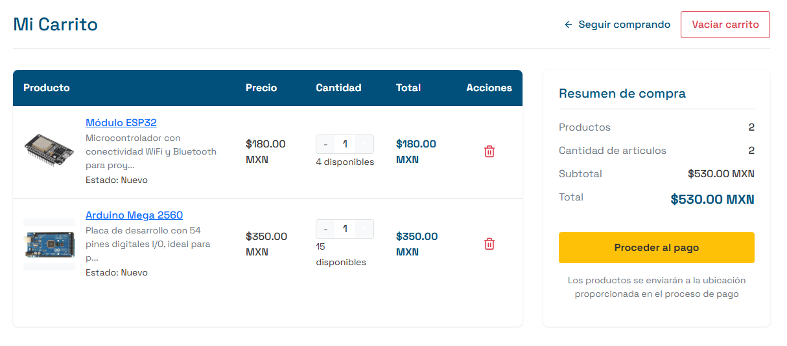
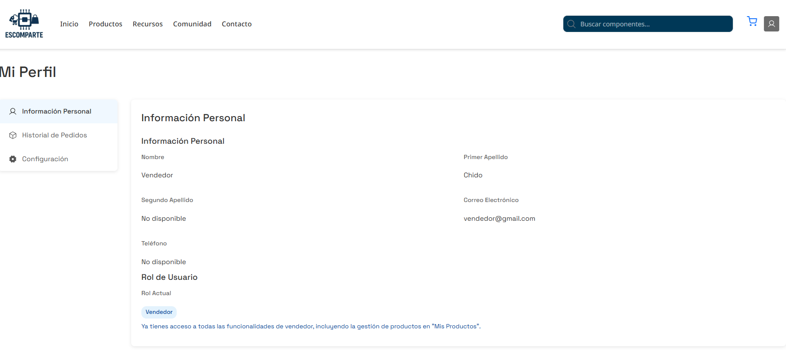

# 🛒 ESCOMPARTE

## Plataforma de Intercambio para la Comunidad ESCOM

**ESCOMPARTE** es una aplicación web diseñada exclusivamente para la comunidad de la Escuela Superior de Cómputo (ESCOM-IPN), con el objetivo de facilitar el intercambio, compra, venta y donación de materiales académicos, componentes electrónicos y proyectos estudiantiles.



---

## 📝 Descripción del Proyecto

ESCOMPARTE surge como respuesta a una necesidad real dentro de la comunidad ESCOM: contar con una plataforma centralizada donde estudiantes, profesores y egresados puedan intercambiar materiales académicos y componentes electrónicos, promoviendo la reutilización de recursos y fomentando la colaboración dentro del entorno académico.

La plataforma permite a los usuarios registrar productos para su venta, intercambio o donación, facilitando la comunicación entre los miembros de la comunidad ESCOM y optimizando el proceso de adquisición de componentes necesarios para proyectos académicos.

---

## 🚀 Características Principales

- **Sistema de registro y autenticación** para miembros de la comunidad ESCOM
- **Catálogo de productos** con imágenes, descripciones detalladas y categorías
- **Opciones de compra, venta, intercambio y donación** de componentes
- **Carrito de compras** para gestionar las adquisiciones
- **Panel de usuario** para gestionar productos y transacciones
- **Sistema de filtrado** por categorías, precio y disponibilidad
- **Perfiles de vendedor y comprador** para facilitar el intercambio

---

## 💻 Tecnologías Utilizadas

### Frontend
- **React 19**: Biblioteca para construir interfaces de usuario
- **Vite**: Herramienta de compilación rápida para desarrollo
- **React Router**: Navegación entre páginas
- **Bootstrap**: Framework de CSS para diseño responsive
- **Context API**: Manejo de estado global (autenticación, carrito)

### Backend
- **Node.js**: Entorno de ejecución para JavaScript
- **Express**: Framework para aplicaciones web
- **PostgreSQL**: Base de datos relacional
- **JWT**: Autenticación basada en tokens
- **Multer**: Manejo de subida de archivos e imágenes
- **Sharp**: Optimización de imágenes

### Herramientas de Desarrollo
- **Git & GitHub**

---

## 🏗️ Arquitectura del Proyecto

El proyecto sigue una arquitectura moderna de aplicación web:

```
escomparte/
├── frontend/         # Aplicación React (Vite)
│   ├── src/          # Código fuente
│   │   ├── components/  # Componentes de React
│   │   ├── contexts/    # Context API para estado global
│   │   ├── services/    # Servicios para API
│   │   └── assets/      # Imágenes y recursos estáticos
│   └── public/       # Archivos públicos
│
├── backend/          # Servidor Node.js/Express
│   ├── routes/       # Rutas de API
│   ├── controllers/  # Lógica de negocio
│   ├── models/       # Modelos de datos
│   ├── db/           # Configuración de base de datos
│   └── public/       # Almacenamiento de archivos subidos
```
---

## 🎯 Objetivo del Proyecto

El objetivo principal de ESCOMPARTE es fomentar una cultura de colaboración y sostenibilidad dentro de la comunidad ESCOM-IPN, facilitando:

1. **Acceso equitativo** a materiales educativos y componentes electrónicos
2. **Reducción del desperdicio** mediante la reutilización de materiales
3. **Optimización de recursos económicos** para estudiantes
4. **Creación de una red de intercambio** específica para la comunidad ESCOM
5. **Promoción de proyectos estudiantiles** a través de la plataforma

---

## 📱 Capturas de Pantalla

### Página Principal


### Catálogo de Productos


### Detalles de Producto


### Carrito de Compras


### Panel de Usuario


---

## 👨‍💻 Desarrollado por

Este proyecto fue desarrollado como parte del programa académico de la Escuela Superior de Cómputo (ESCOM) del Instituto Politécnico Nacional (IPN), con el objetivo de aplicar conocimientos en desarrollo web y crear una solución real para la comunidad estudiantil.

---

## 📄 Licencia

Este proyecto fue creado con fines educativos y está disponible para uso interno de la comunidad ESCOM-IPN.

---

**ESCOMPARTE: Conectando a la comunidad ESCOM a través del intercambio de conocimiento y tecnología.**
